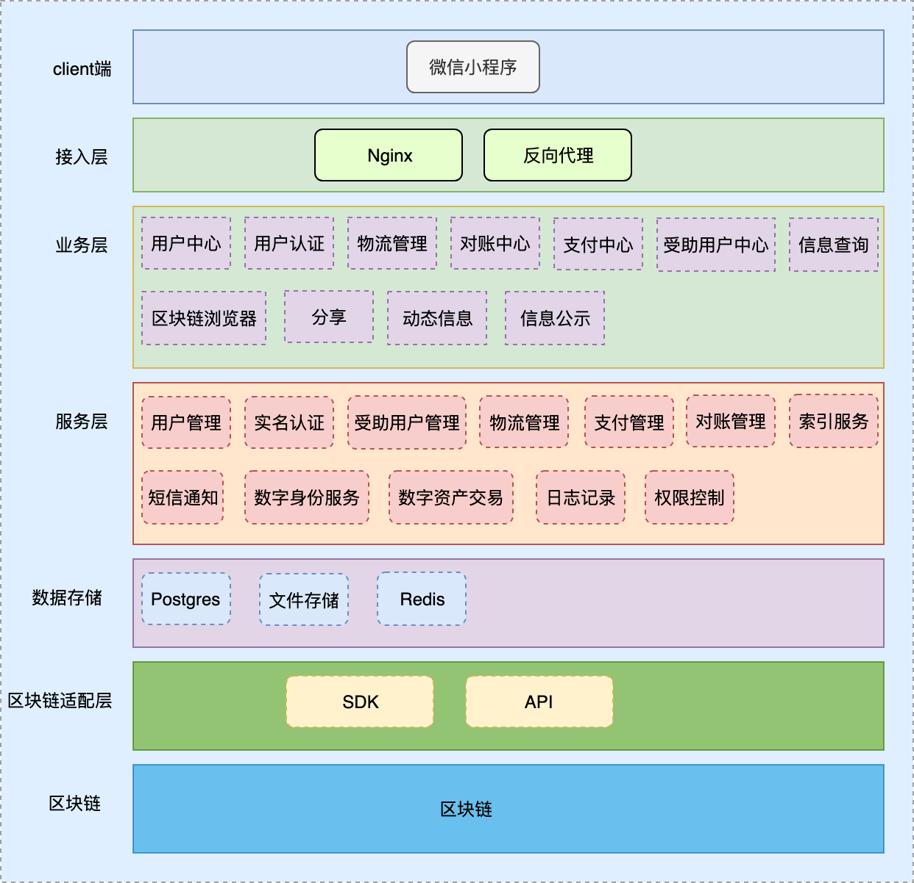
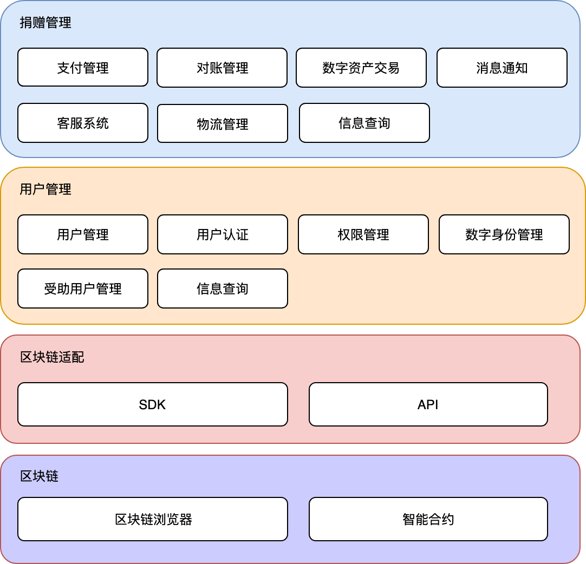

=======================
软件架构
=======================

架构图
=======================

上层主要为业务层和服务层，处理捐赠操作，底层主要负责数据存储层和区块链层，用来实现数据上链。

后端功能模块
=======================

后端主要分为三个模块：
-----------------------

用户管理
-----------------------

实现个人用户和组织机构用户的身份认证，能够快速的在整个捐赠生命周期中定位到某个组织机构或个人。

捐赠管理
-----------------------

捐赠、分发或接受来自捐赠者的资金和物品，并提供公示信息查询功能。

数据上链
-----------------------

得益于区块链的数据不可篡改和可靠性，在整个捐赠的生命周期中，重要信息全部上传到区块链存证。

前端功能模块
=======================

   .. image:: ../../images/developing/architecture/frontend_module.png
      :width: 800px
      :align: center

前端主要分为四个部分：
-----------------------

用户管理
-----------------------

用户管理除了实现账户注册、登录、密码找回，还提供了实名认证功能。

捐赠管理
-----------------------

捐赠管理主要对善款及物品相关信息进行记录和管理。

数据展示
-----------------------

主要提供组织机构和公示信息的展示，可以方便的跟踪某一笔捐赠，查看捐赠的状态。

分享及反馈
-----------------------

用户可以将捐赠或受捐信息分享到社交平台，一些异常捐赠和软件使用反馈会提交给捐赠平台，以供后续处理和优化。

